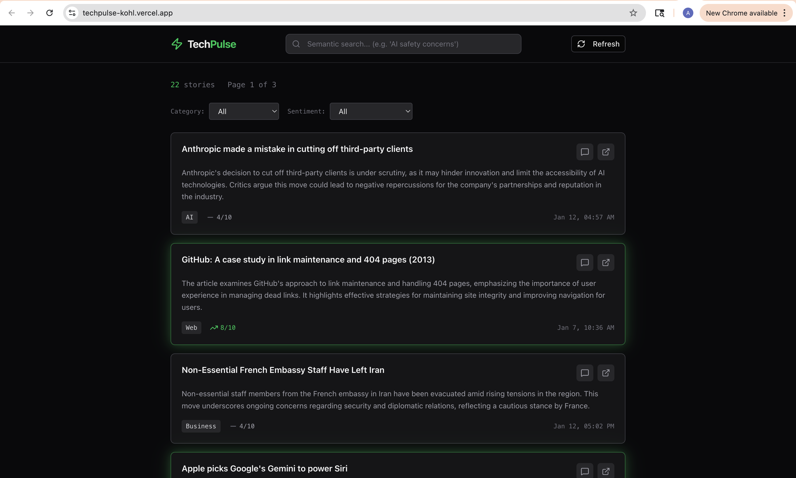

# TechPulse

A tech news aggregator that pulls top stories from Hacker News and uses AI to generate quick summaries.

**Live demo:** https://techpulse-kohl.vercel.app



---

## Running Locally

```bash
git clone https://github.com/anuzzzzz/tech-pulse.git
cd tech-pulse
npm install
npm run dev
```

Open http://localhost:3000

## Setup

Create a `.env.local` file:

```
DATABASE_URL=your_supabase_connection_string
OPENAI_API_KEY=your_openai_key
CRON_SECRET=any_random_string
```

You'll need:
- A Supabase project (free tier works)
- An OpenAI API key with GPT-4o-mini access

Then push the database schema:

```bash
npx drizzle-kit push
```

And enable the vector extension in Supabase SQL editor:

```sql
create extension if not exists vector;
```

## Running Tests

```bash
npx tsx src/lib/test-all-features.ts
```

This runs through database connections, API integrations, and core features.

---

## What I Built

- **AI summaries** - Each article gets a 2-sentence summary, sentiment score (1-10), and category via GPT-4o-mini
- **Semantic search** - Search by meaning using pgvector embeddings ("AI safety articles" actually works)
- **Chat with articles** - Click any article to ask follow-up questions, streams responses
- **Filtering** - Filter by category (AI, Security, Web, etc.) and sentiment (positive/neutral/negative)
- **Email subscription** - Collects emails for future digest feature
- **Auto-refresh** - Daily cron job fetches new stories (Vercel free tier limit)

---

## Approach

I wanted to build something that feels fast. Instead of calling OpenAI every time someone loads the page (slow, expensive), I fetch and summarize articles in the background. Users always see pre-processed content instantly.

The flow:
1. Cron job hits Hacker News API daily (Vercel's free tier only allows daily crons)
2. For each new story, GPT-4o-mini generates a 2-sentence summary, sentiment score (1-10), and category
3. Everything gets stored in Postgres
4. Frontend just reads from the database - no waiting

I also added semantic search using pgvector. Each article gets an embedding, so you can search by meaning rather than exact keywords.

## Tradeoffs

**GPT-4o-mini over GPT-4o** - The summaries are good enough for this use case, and it's way cheaper/faster. For something like legal document analysis I'd use the bigger model.

**Supabase over self-hosted Postgres** - Faster to set up, has pgvector built in, and the connection pooling just works. Downside is vendor lock-in but that's fine for a project this size.

**Server Actions over API routes** - Next.js 15 thing. Less boilerplate, type-safe by default. I only used a traditional API route for the cron endpoint since Vercel cron needs a URL to hit.

**Storing embeddings per-article** - Takes more storage but makes search instant. Alternative would be generating embeddings at query time but that adds latency.

---

## AI Tools Used

**Gemini & Claude Opus** - Used both for initial tech stack planning and architecture decisions. Compared different approaches (separate backend vs Next.js Server Actions, various database options, embedding strategies) and finalized the stack based on their recommendations.

**Claude Sonnet** - Used as a coding assistant throughout implementation. Helped me debug a tricky Supabase connection pooler issue (was using wrong port), figure out Tailwind v4's new syntax, and understand Vercel AI SDK's streaming API. I drove the implementation and wrote the core logic, used Claude to speed up development and troubleshoot.

**GPT-4o-mini** - Powers the product itself. Generates summaries, sentiment scores, and handles the chat feature.

**text-embedding-3-small** - Generates vector embeddings for semantic search.

---

## What I'd Build Next

With more time:

- **Actually send the email digests** - The subscribe form collects emails but doesn't send anything yet. Would set up daily/weekly sends with Resend.
- **Source diversity** - Only pulling from HN right now. Would add TechCrunch, Ars Technica, maybe Reddit. Each source needs its own parser.
- **Better error handling** - If OpenAI rate limits, the cron just fails silently. Should add retries and alerting.
- **User accounts** - Save articles, customize feed, set up topic alerts.

---

## Tech Stack

- Next.js 15 (App Router)
- TypeScript
- Tailwind CSS
- Drizzle ORM
- Supabase (Postgres + pgvector)
- Vercel AI SDK
- OpenAI API
